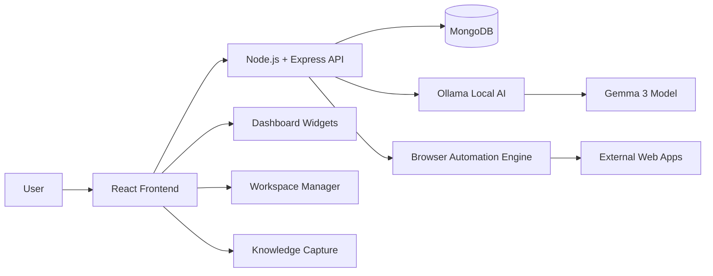
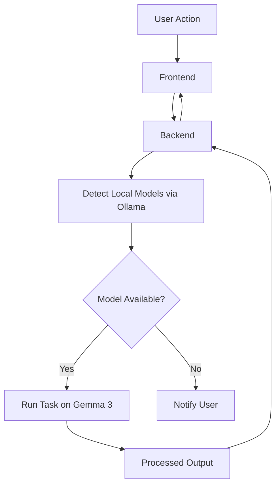
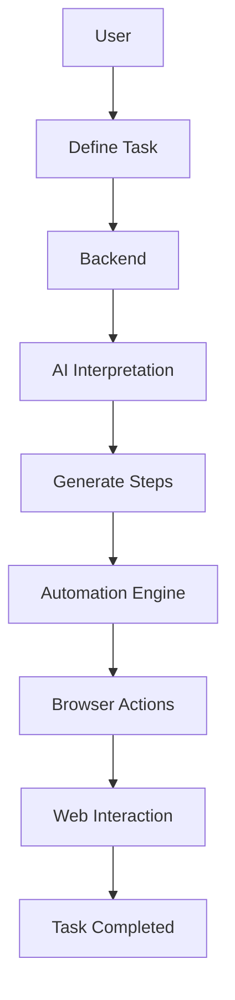
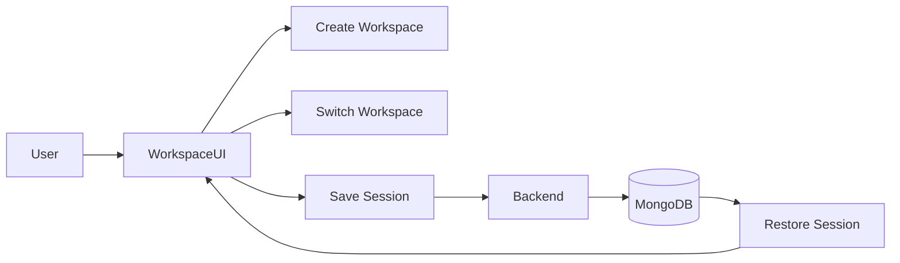
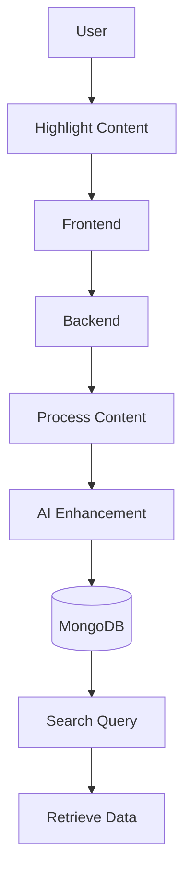
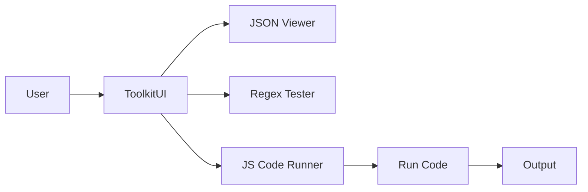
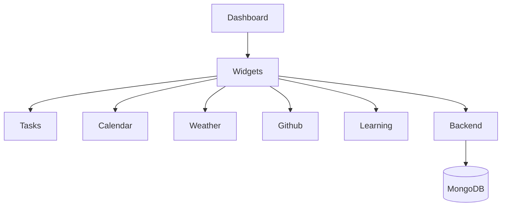
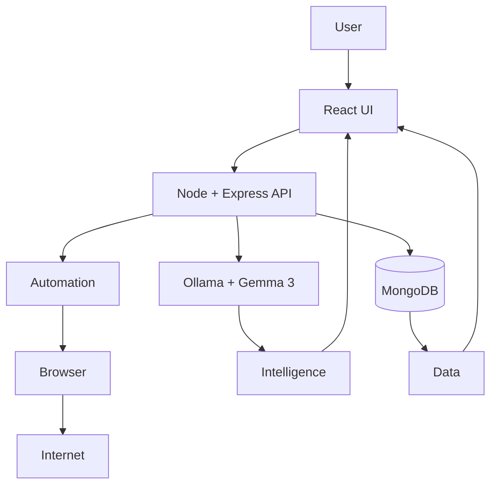

Here is a clean, professional **GitHub README.md** you can directly use. It includes your technical description and all Mermaid diagrams structured properly.

---

# The Shak Space

The Shak Space is an internet oriented workspace designed to transform the browser into a structured working environment. Instead of treating the browser as a collection of tabs and tools, this system focuses on managing knowledge, workflows and automation directly within the web layer.

The goal is not to replicate a traditional operating system, but to build a system that enhances how users interact with the internet itself.

---

## Overview

Modern workflows are fragmented across multiple tabs, tools and platforms. The Shak Space aims to solve this by introducing a unified system that allows users to organize, automate and enhance their internet usage.

The system combines workspace management, knowledge capture, automation and local AI into a single cohesive environment.

---
---

## System Architecture

---

## Tech Stack

The project is built using the MongoDB Express.js React Node.js stack.

React is used for building a modular frontend with dynamic UI components such as panels, overlays and dashboards.

Node.js with Express.js handles backend APIs, session management, automation workflows and system orchestration.

MongoDB is used for storing user data including knowledge, sessions, automation rules and workspace states.

---

## Local AI Integration

A core part of the system is local AI execution using Ollama with models such as Gemma 3.

The system detects locally installed models and uses them directly for:

* Webpage summarization
* Code explanation
* Content rewriting
* Data extraction
* Context aware assistance

This removes dependency on external APIs and enables cost free automation and intelligence.

---

## Core Features

### Universal Web Command Center

Centralized access to frequently used web applications and saved links.

### Knowledge Capture System

Capture highlights, links and notes from any webpage and store them for later retrieval.

### Smart Workspaces

Group tabs and sessions based on context such as coding, research or learning.

### Browser Automation Engine

Automate repetitive web tasks such as navigation, form filling and data extraction. Conceptually similar to Zapier but deeply integrated into the browser.

### Developer Toolkit

Includes utilities like JSON viewer, regex tester and JavaScript code runner.

### Dashboard

Aggregates tasks, calendar data, activity and insights into a unified interface.

### AI Assistant Layer

Provides contextual intelligence across all modules using local AI models.

## AI Integration Flow

---

## Automation Flow

---

## Workspace Management

---

## Knowledge Capture System

---

## Developer Toolkit

---

## Dashboard System

---

## Complete System Flow

---

## Current Status

The initial architecture has been designed and core modules are being implemented. Current focus areas include performance optimization, UI refinement and replacing placeholder features with functional systems.

---

## Future Direction

* Deeper AI integration across workflows
* Smarter automation suggestions
* Improved performance and scalability
* Cross device synchronization

---

## Contribution

This is an evolving project. Feedback, suggestions and discussions are welcome, especially from those working on browser systems, automation and local AI.
